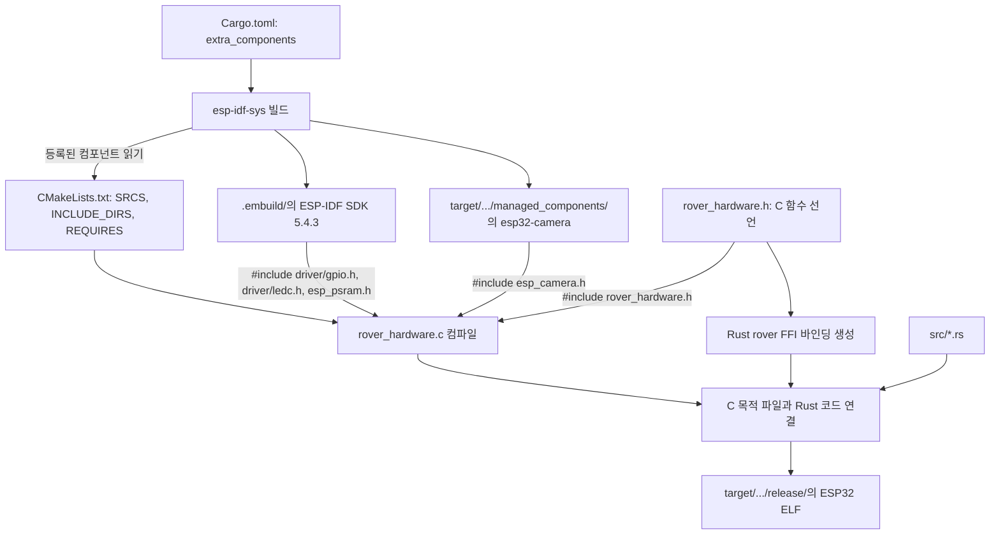
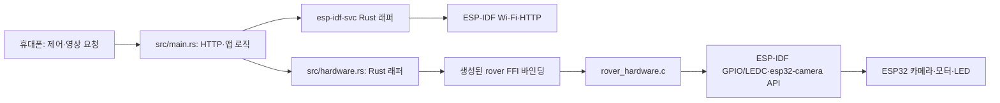

# Cam Rover ESP32 (Rust)

[English README](README.md)

Keyestudio KS5024 ESP32-CAM 4WD 로봇용 Rust 펌웨어입니다. Wi-Fi, HTTP 제어, 이동 판단, 안전 정지 로직은 Rust로 작성했습니다. 카메라·모터 PWM·플래시 LED의 저수준 제어는 작은 C 컴포넌트가 ESP-IDF와 `esp32-camera` API를 호출합니다. 빌드에 Arduino IDE나 Node.js는 필요하지 않습니다.

## 제공 기능

- 로봇 자체 WPA2 Wi-Fi AP: `cam-rover` (기본 암호: `camrover`)
- `http://192.168.71.1` 모바일 제어 화면
- OV2640/OV3660 MJPEG 영상 스트림
- 전진, 후진, 좌우 제자리 회전, 네 방향 대각선 주행, 정지
- 가청 소음을 줄인 20kHz 모터 PWM과 85~255 속도 조절, GPIO4 플래시 LED
- 마지막 이동 명령 이후 700ms가 지나면 모터 자동 정지

## Rust와 C가 연결되는 방식

`.h` 파일은 언어 경계에서 공유할 함수의 이름과 입출력 타입을 선언하고, `.c` 파일은 함수를 구현합니다. `CMakeLists.txt`는 ESP-IDF 컴포넌트의 규약 파일로, 컴파일할 C 소스·헤더 폴더·의존 컴포넌트를 지정합니다. `Cargo.toml`은 `esp-idf-sys`에 컴포넌트 폴더와 Rust 바인딩 생성에 사용할 헤더를 알려줍니다. `#include`는 C 컴파일러에 함수와 타입 선언을 보여 주는 것이지 SDK 전체를 소스 파일에 복사하는 명령이 아닙니다. 빌드 과정에서 C 구현체와 Rust 앱을 각각 컴파일하고 최종 연결합니다.

예를 들어 `rover_hardware.c`는 다음을 포함한 헤더들을 읽습니다.

```c
#include "rover_hardware.h"
#include "driver/gpio.h"
#include "driver/ledc.h"
#include "esp_camera.h"
#include "esp_psram.h"
```

`CMakeLists.txt`의 `REQUIRES esp32-camera driver esp_psram`이 해당 헤더 경로와 라이브러리 의존성을 제공하고, C 컴파일 시 선언을 확인한 뒤 구현체는 최종 펌웨어에 연결됩니다.



보드에서 실행될 때 호출 흐름은 다음과 같습니다.



| 기능 | C 브리지에서 호출하는 SDK 함수 | 결과 |
| --- | --- | --- |
| 카메라 초기화 | `esp_psram_is_initialized`, `esp_camera_init`, 센서 반전 설정 | 프레임 버퍼와 JPEG 설정 선택 |
| 영상 촬영·반납 | `esp_camera_fb_get` / `esp_camera_fb_return` | Rust가 JPEG를 MJPEG로 전송한 뒤 버퍼 반납 |
| 모터 구동 | `ledc_timer_config`, `ledc_channel_config`, `ledc_set_duty` | L298N 입력 핀에 20kHz PWM 출력 |
| 조명 제어 | `gpio_config`, `gpio_set_level` | GPIO4 플래시 LED 제어 |

Wi-Fi와 HTTP는 Rust가 `esp-idf-svc`를 통해 직접 사용합니다. 이 프로젝트의 C 브리지는 카메라·모터 PWM·LED에만 사용되며, 촬영한 프레임 데이터는 브리지를 거쳐 Rust의 HTTP 스트림으로 돌아옵니다. C 드라이버를 FFI로 호출하는 것은 이 프로젝트의 설계 선택이지 Rust로 하드웨어를 제어할 때 항상 필요한 조건은 아닙니다.

## 소스와 의존성의 위치

| 경로 | 역할 |
| --- | --- |
| `Cargo.toml` | Rust 의존성과 ESP-IDF 5.4.3·`esp32-camera` 2.1.7 설정 |
| `Cargo.lock` | 확정된 Rust 크레이트 버전 |
| `components_esp32.lock` | 생성된 ESP-IDF 컴포넌트 버전. 이 저장소에서는 Git에서 제외 |
| `rust-toolchain.toml`, `.cargo/config.toml` | ESP Xtensa 툴체인, 타깃, 링커, 업로드 실행 설정 |
| `src/*.rs` | Rust 앱, 이동 로직, C 호출을 감싼 래퍼 |
| `src/web/index.html` | `include_str!`로 펌웨어에 포함되는 조종 화면 |
| `components/rover_hardware/include/rover_hardware.h` | Rust 바인딩 생성에 쓰는 C 함수 선언 |
| `components/rover_hardware/rover_hardware.c` | SDK 헤더를 사용한 카메라·모터·LED 구현 |
| `components/rover_hardware/CMakeLists.txt` | C 소스와 ESP-IDF 의존 컴포넌트 등록 |
| `~/.cargo/registry/` | Cargo가 보통 crates.io에서 받는 Rust 라이브러리 소스의 공용 캐시 |
| `~/.rustup/toolchains/esp/` | `espup`이 설치한 ESP용 Rust 컴파일러와 표준 라이브러리 소스 |
| `.embuild/espressif/` | 첫 빌드에 준비하고 재사용하는 ESP-IDF SDK, C 도구, Python 환경 |
| `target/.../managed_components/` | ESP-IDF 컴포넌트 매니저가 받은 `esp32-camera` 등의 컴포넌트 |
| `target/xtensa-esp32-espidf/release/` | 중간 빌드 파일과 최종 ESP32 ELF, 선택적으로 만든 통합 `.bin` |

`target/`은 펌웨어 파일 하나가 아닌 빌드 폴더입니다. 확장자가 없는 `target/xtensa-esp32-espidf/release/cam-rover-esp32`가 `espflash`에 전달하는 ELF입니다. 통합 `.bin`은 별도로 생성할 수 있는 플래시 이미지입니다. `.embuild/`와 `~/.cargo/registry/`는 로봇에서 실행되지 않으며, 로봇은 플래시에 기록된 펌웨어만 실행합니다.

## 하드웨어 배선

| ESP32-CAM | L298N 입력 |
| --- | --- |
| GPIO14 | IN1 (오른쪽) |
| GPIO15 | IN2 (오른쪽) |
| GPIO13 | IN3 (왼쪽) |
| GPIO12 | IN4 (왼쪽) |
| 5V | 5V |
| GND | GND |

L298N의 ENA/ENB 점퍼는 꽂아 둡니다. microSD 핀과 모터 핀이 겹쳐서 이 펌웨어에서는 microSD를 사용할 수 없습니다.

## macOS 개발 도구 설치

ESP32는 Xtensa 타깃이므로 일반적인 Mac용 Rust 설치만으로는 빌드할 수 없습니다. 새 Mac에서 아래를 한 번 실행합니다. Apple Command Line Tools가 이미 있다면 첫 명령은 생략하세요. Rust 설치 프로그램이 요청하면 새 터미널을 여세요.

```bash
xcode-select --install
curl --proto '=https' --tlsv1.2 -sSf https://sh.rustup.rs | sh
source "$HOME/.cargo/env"
cargo +stable install espup --locked
espup install
cargo +stable install ldproxy --locked
cargo +stable install espflash --locked
```

빌드에 사용할 새 터미널을 열 때마다 ESP 환경을 적용합니다.

```bash
source "$HOME/.cargo/env"
source "$HOME/export-esp.sh"
```

`espup`은 ESP용 Rust 툴체인을 설치하고, `ldproxy`는 Rust와 ESP-IDF를 연결하며, `espflash`는 USB로 보드에 기록합니다. 첫 `cargo build`가 지정된 ESP-IDF SDK와 C 도구를 다운로드해 준비합니다. Cargo는 Rust 라이브러리를 `~/.cargo/registry/`에 받고, ESP-IDF 컴포넌트 매니저는 `esp32-camera`와 그 의존성을 빌드 출력 폴더에 받습니다. 이후 빌드는 저장된 파일을 재사용합니다. Arduino IDE와 Node.js를 따로 설치할 필요는 없습니다.

USB 직렬 포트가 보이지 않으면 먼저 케이블과 어댑터를 확인하세요. CH340 기반 어댑터 일부는 macOS 직렬 드라이버가 필요할 수 있습니다.

## 빌드·업로드·실행

아래 명령은 저장소 루트에서 실행합니다. USB 어댑터를 연결할 때 배터리·모터 전원은 끄고, 첫 시험에서는 바퀴를 바닥에서 띄우세요. 예시 포트 이름은 `espflash list-ports`로 나온 실제 값으로 바꿉니다.

```bash
espflash list-ports
cargo build --release
espflash flash --port /dev/cu.usbserial-XXXX \
  target/xtensa-esp32-espidf/release/cam-rover-esp32
```

어댑터가 자동으로 다운로드 모드에 들어가지 못하면 BOOT를 누른 채 RESET을 한 번 누르고 업로드를 다시 시도하세요. 업로드가 끝나면 BOOT에서 손을 떼고 RESET을 누릅니다. 휴대폰에서 `cam-rover` Wi-Fi에 기본 암호 `camrover`로 연결한 뒤 `http://192.168.71.1`을 엽니다.

빌드·업로드·직렬 로그 보기를 한 명령으로 실행하는 방법도 있습니다.

```bash
cargo run --release
```

이 프로젝트에서 `cargo run`은 Mac에서 로봇 프로그램을 실행하지 않습니다. `.cargo/config.toml`의 runner가 `espflash flash --monitor`이므로 **ESP32에 기록하고 보드 로그를 보는 명령**입니다. 직렬 포트가 여러 개라면 `espflash`가 선택을 요청할 수 있습니다. Ctrl-C로 모니터를 종료합니다.

## 빌드 시점 설정

Wi-Fi 이름·암호와 카메라 상하 반전 설정은 펌웨어에 컴파일되어 들어갑니다. WPA2 암호는 8자 이상이어야 합니다. 카메라 조립 방향에 맞춰 기본값은 상하 반전입니다.

```bash
ROVER_WIFI_SSID=my-rover \
ROVER_WIFI_PASSWORD=change-me \
ROVER_VIDEO_FLIP=0 \
cargo build --release

espflash flash --port /dev/cu.usbserial-XXXX \
  target/xtensa-esp32-espidf/release/cam-rover-esp32
```

기본 상하 반전을 사용하지 않을 때만 `ROVER_VIDEO_FLIP=0`을 지정하세요. 빌드 시점 값을 바꾼 뒤에는 다시 빌드하고 업로드해야 합니다. Mac 환경변수만 바꿔서는 로봇에 이미 기록된 펌웨어가 바뀌지 않습니다.

## 안전과 문제 해결

- 첫 모터 시험에서는 바퀴를 띄우세요. 안전 태스크가 마지막 이동 명령 700ms 뒤 모터를 정지시킵니다.
- ESP32-CAM은 2.4GHz Wi-Fi를 사용합니다. 영상 스트림은 로컬 AP 안에서 암호화되지 않은 HTTP이므로 인터넷에 포트 포워딩하지 마세요.
- 주행 중 재부팅되거나 영상이 끊기면 배터리 전압, 공통 GND, L298N 전원 배선을 확인하세요.
- 직렬 포트가 없으면 케이블·어댑터·드라이버·권한을 확인하세요. 업로드 연결에 실패하면 위의 BOOT + RESET 순서를 시도하세요.
- 첫 빌드는 SDK를 다운로드·컴파일하므로 오래 걸릴 수 있습니다. `target/`을 삭제하면 소스가 아니라 빌드 결과를 버리게 됩니다.
