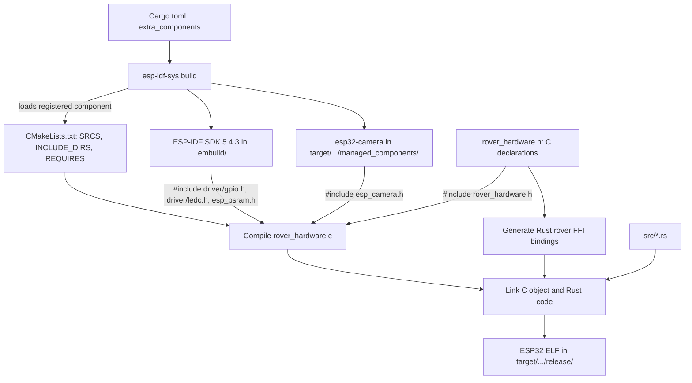
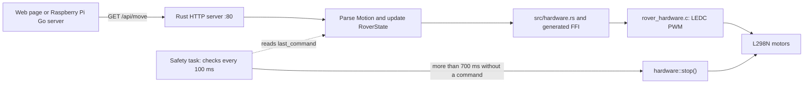
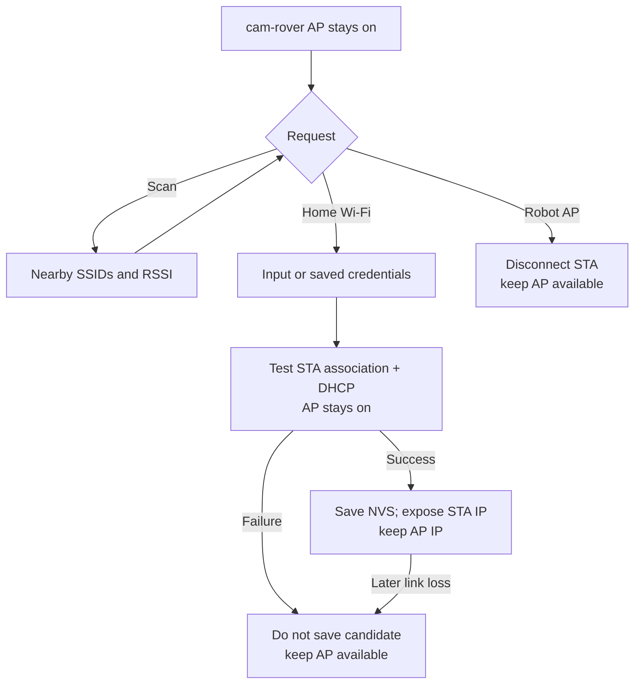

# Cam Rover ESP32 (Rust)

[한국어 README](README.ko.md)

Rust firmware for the Keyestudio KS5024 ESP32-CAM 4WD robot. Rust handles Wi-Fi, HTTP control, motion decisions, and the safety timeout. A small C component calls ESP-IDF and `esp32-camera` APIs for the camera, motor PWM, and flash LED. Arduino IDE is not required to build this firmware.

## Features

- WPA2 access point: `cam-rover` (default password: `camrover`)
- Scan nearby 2.4 GHz networks and verify a home Wi-Fi connection before saving credentials
- Keep the robot AP at `http://192.168.71.1` while also serving the control page at the router-assigned IP when STA is connected
- OV2640/OV3660 MJPEG video stream
- Forward, backward, left/right rotation, four diagonal directions, and stop
- 20 kHz motor PWM with speed control from 85 to 255; GPIO4 flash LED
- Automatic motor stop 700 ms after the last movement command

## How the Rust and C parts fit together

The `.h` file declares the functions shared across the language boundary; the `.c` file implements them. `CMakeLists.txt` is the conventional ESP-IDF component build file: it names the C source, public header directory, and component dependencies. `Cargo.toml` points `esp-idf-sys` to the component directory and header from which Rust bindings are generated. `#include` makes declarations available to the C compiler; it does not copy an entire SDK into the source file. The build system compiles the C implementation and links it with the Rust application.

For example, `rover_hardware.c` includes these headers (among others):

```c
#include "rover_hardware.h"
#include "driver/gpio.h"
#include "driver/ledc.h"
#include "esp_camera.h"
#include "esp_psram.h"
```

`REQUIRES esp32-camera driver esp_psram` in `CMakeLists.txt` makes the corresponding headers and libraries available. The declarations are checked during C compilation; the implementations are linked into the firmware later.



At runtime, movement commands and the safety timeout follow this path:



| Operation | C bridge and SDK call | Result |
| --- | --- | --- |
| Initialize camera | `esp_psram_is_initialized`, `esp_camera_init`, sensor flip settings | Selects frame buffers and JPEG settings for the camera |
| Capture/release a frame | `esp_camera_fb_get` / `esp_camera_fb_return` | Rust serves JPEG bytes as MJPEG, then returns the buffer |
| Drive motors | `ledc_timer_config`, `ledc_channel_config`, `ledc_set_duty` | Sets 20 kHz PWM on the L298N input pins |
| Toggle light | `gpio_config`, `gpio_set_level` | Controls GPIO4 flash LED |

Rust uses `esp-idf-svc` directly for Wi-Fi and HTTP. Only the camera, motor PWM, and LED operations go through the local C bridge; captured frame bytes travel back through that bridge to the separate MJPEG server on port 81. Calling C through FFI is a design choice for these existing drivers, not a general requirement of Rust.

## Source and dependency locations

| Path | Purpose |
| --- | --- |
| `Cargo.toml` | Rust dependencies and ESP-IDF 5.4.3 / `esp32-camera` 2.1.7 configuration |
| `Cargo.lock` | Resolved Rust crate versions |
| `components_esp32.lock` | Generated ESP-IDF component versions; excluded from Git in this repository |
| `rust-toolchain.toml`, `.cargo/config.toml` | ESP Xtensa toolchain, target, linker, and flash runner |
| `src/*.rs` | Rust application, motion logic, and safe wrappers around the C calls |
| `src/network.rs` | AP+STA runtime, Wi-Fi scanning/testing, NVS settings, and AP fallback |
| `src/web/index.html` | Control page embedded in the firmware with `include_str!` |
| `components/rover_hardware/include/rover_hardware.h` | C declarations used to generate Rust bindings |
| `components/rover_hardware/rover_hardware.c` | Camera, motor, and LED implementation using SDK headers |
| `components/rover_hardware/CMakeLists.txt` | Registers the C source and its ESP-IDF dependencies |
| `~/.cargo/registry/` | Shared local cache of Rust crate source downloaded by Cargo, normally from crates.io |
| `~/.rustup/toolchains/esp/` | ESP-capable Rust compiler and standard-library sources installed by `espup` |
| `.embuild/espressif/` | ESP-IDF SDK, C tools, and Python environment prepared by the first build and reused later |
| `target/.../managed_components/` | ESP-IDF Component Manager's downloaded components, including `esp32-camera` |
| `target/xtensa-esp32-espidf/release/` | Build intermediates and the final ESP32 ELF; an optional merged `.bin` may also be here |

`target/` is not one firmware file. The file without an extension at `target/xtensa-esp32-espidf/release/cam-rover-esp32` is the ELF passed to `espflash`. A merged `.bin`, if generated separately, is a flash image. Neither `.embuild/` nor `~/.cargo/registry/` runs on the robot; the ESP32 executes the firmware written to its flash.

## Hardware wiring

| ESP32-CAM | L298N input |
| --- | --- |
| GPIO14 | IN1 (right) |
| GPIO15 | IN2 (right) |
| GPIO13 | IN3 (left) |
| GPIO12 | IN4 (left) |
| 5V | 5V |
| GND | GND |

Keep the L298N ENA/ENB jumpers fitted. This firmware cannot use microSD because its pins overlap the motor pins.

## macOS development setup

The ESP32 target uses Xtensa, so an ordinary host-only Rust installation is insufficient. Run the following once on a new Mac; skip the Apple Command Line Tools command if they are already installed. Open a new terminal if the Rust installer asks you to.

```bash
xcode-select --install
curl --proto '=https' --tlsv1.2 -sSf https://sh.rustup.rs | sh
source "$HOME/.cargo/env"
cargo +stable install espup --locked
espup install
cargo +stable install ldproxy --locked
cargo +stable install espflash --locked
```

In each new terminal session used for building, load the ESP environment:

```bash
source "$HOME/.cargo/env"
source "$HOME/export-esp.sh"
```

`espup` installs the ESP-capable Rust toolchain; `ldproxy` links Rust with ESP-IDF; `espflash` writes the result over USB. The initial `cargo build` downloads and prepares the specified ESP-IDF SDK and its C tools. Cargo fetches Rust crates to `~/.cargo/registry/`; the ESP-IDF Component Manager fetches `esp32-camera` and its dependencies into the build output. Later builds reuse what is already present. No manual Arduino IDE installation is needed.

If no USB serial port appears, check the USB cable and adapter first. Some CH340-based adapters may need a macOS serial driver.

## Build, flash, and run

Run these commands from the repository root. Keep the battery/motor power off while connecting the USB adapter, and test with the wheels raised. Replace the example port with the value returned by `espflash list-ports`.

```bash
espflash list-ports
cargo build --release
espflash flash --port /dev/cu.usbserial-XXXX \
  target/xtensa-esp32-espidf/release/cam-rover-esp32
```

If the adapter does not automatically enter download mode, hold BOOT and tap RESET, then retry the flash command. After flashing, release BOOT and tap RESET. Connect a phone to `cam-rover` using the default password `camrover`, then open `http://192.168.71.1`. Flashing normally preserves NVS; a previously configured board also retries the saved home Wi-Fi in the background while its AP remains available.

For a combined build, flash, and serial monitor, the repository's Cargo runner also supports:

```bash
cargo run --release
```

Here `cargo run` runs the ELF on the **ESP32**, not on the Mac: `.cargo/config.toml` sets the runner to `espflash flash --monitor`. If several serial ports are available, `espflash` may ask you to choose one. Use Ctrl-C to leave the monitor.

## HTTP control and network mode

The robot starts its WPA2 AP at `http://192.168.71.1` on every boot. If valid saved home Wi-Fi credentials are preferred, it tests that 2.4 GHz WPA2-personal connection in the background. The AP remains available in either case. A successful STA connection adds a router-assigned IP; a failed test or later link loss leaves the AP usable. The control page can scan nearby networks, but a scan only proves that an SSID is visible. The actual connection test checks association and DHCP before candidate credentials are saved.

`POST /api/network` returns HTTP 202 and performs the test asynchronously, without rebooting. Poll `GET /api/network` for `phase` (`testing`, `connected`, `failed`, `idle`), `last_error`, `sta_configured`, `saved_ssid`, `sta_ip`, and `ap_ip`. `POST /api/wifi/scan` starts a scan; poll `GET /api/wifi/scan` for its result (up to 16 networks). An operation already in progress returns HTTP 409. Scanning or switching stops the motors. The AP and STA share one radio, so video or the AP link may pause briefly when the channel changes.



After a failed attempt, the previous saved credentials remain. If the preferred mode is STA, the next reboot retries them. A background health check also marks a later STA link loss as AP fallback. A web page cannot change a phone's Wi-Fi network: the phone can keep controlling through the robot AP, or the user can join home Wi-Fi manually and open the displayed STA address. AP channel changes can still cause a short interruption.

From a Raspberry Pi on the same network, substitute the robot's IP for `ROVER_IP`. Repeat movement commands more often than every 700 ms; the safety timer otherwise stops the motors. Send `stop` when releasing a control.

```bash
curl "http://ROVER_IP/api/move?direction=forward-left"
curl "http://ROVER_IP/api/move?direction=stop"
curl "http://ROVER_IP/api/speed?value=170"
curl "http://ROVER_IP/api/light?on=1"
curl "http://ROVER_IP/api/network"
curl -X POST "http://ROVER_IP/api/wifi/scan"
curl "http://ROVER_IP/api/wifi/scan"
curl -X POST "http://ROVER_IP/api/network" -H 'Content-Type: application/json' \
  -d '{"mode":"sta","ssid":"YOUR_2_4_GHZ_SSID","password":"YOUR_PASSWORD"}'
curl -X POST "http://ROVER_IP/api/network" -H 'Content-Type: application/json' \
  -d '{"mode":"sta"}' # retry saved credentials
curl -X POST "http://ROVER_IP/api/network" -H 'Content-Type: application/json' \
  -d '{"mode":"ap"}'
```

`GET /api/network` returns active/preferred mode, both IPs, live phase, and fallback status, never the password. `{ "mode": "sta" }` retries saved credentials; invalid inputs return 400. HTTP control and video have no application authentication or encryption: use only a trusted local network, and do not port-forward ports 80/81. Change the default robot AP password before use outside a controlled setting.

## Build-time configuration

Robot AP credentials and camera vertical flip are compiled into the firmware; home Wi-Fi credentials are configured at runtime. The AP WPA2 password must contain 8–63 bytes. By default, the video is flipped vertically to match the camera mounting.

```bash
ROVER_WIFI_SSID=my-rover \
ROVER_WIFI_PASSWORD=change-me \
ROVER_VIDEO_FLIP=0 \
cargo build --release

espflash flash --port /dev/cu.usbserial-XXXX \
  target/xtensa-esp32-espidf/release/cam-rover-esp32
```

Set `ROVER_VIDEO_FLIP=0` only if you do **not** want the default vertical flip. After changing a build-time value, rebuild and flash again; changing an environment variable does not reconfigure firmware already on the robot.

## Safety and troubleshooting

- Raise the wheels for the first motor test. The safety task stops motion 700 ms after the last movement command.
- The ESP32-CAM uses 2.4 GHz Wi-Fi. Control and video use plain HTTP in both AP and STA modes; do not expose them to the internet with port forwarding.
- If the device resets or the camera stream stutters while driving, check battery voltage, the shared ground, and the L298N power wiring.
- A missing serial port usually indicates a cable, adapter, driver, or permission issue. A flash connection failure may require BOOT + RESET as described above.
- The first build may take a long time because it downloads and compiles SDK components. Build output appears under `target/`; deleting that directory discards build artifacts, not the source code.
